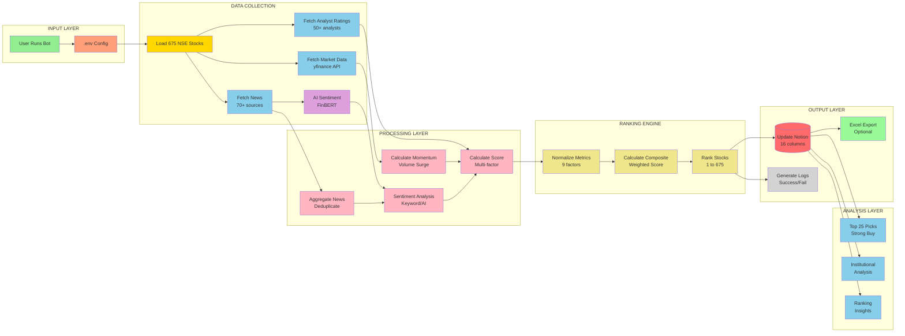
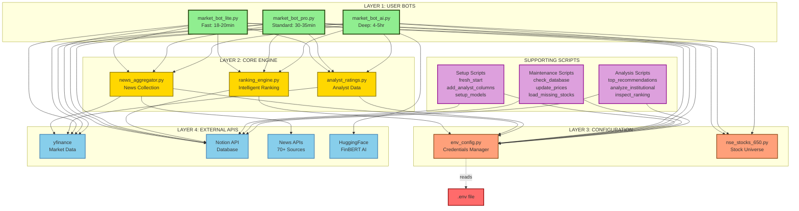
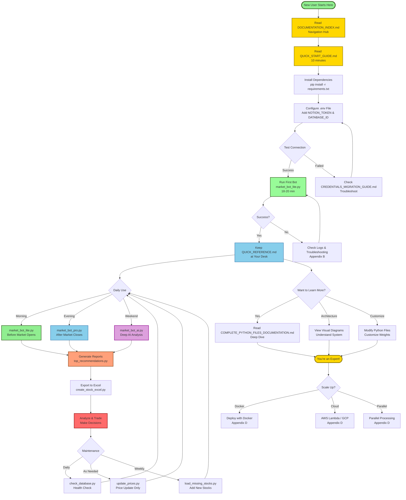

# 🎨 Architecture Diagrams - Mermaid Code
# Market Bot Visual Diagrams

This file contains all the Mermaid diagram definitions. You can:
1. **View in GitHub** - GitHub automatically renders Mermaid diagrams
2. **View in VS Code** - Use Mermaid preview extension
3. **Convert to PNG** - Use https://mermaid.live or https://mermaid.ink
4. **Embed in docs** - Copy code blocks into any Markdown file

---

## Diagram 1: File Relationships & Architecture

Shows how all files connect together, data sources, and outputs.

```mermaid
graph TB
    subgraph "USER ENTRY POINTS"
        LITE[market_bot_lite.py<br/>18-20 min]
        PRO[market_bot_pro.py<br/>30-35 min]
        AI[market_bot_ai.py<br/>4-5 hours]
    end

    subgraph "CORE MODULES"
        RANK[ranking_engine.py<br/>9-metric ranking]
        NEWS[news_aggregator.py<br/>70+ sources]
        ANALYST[analyst_ratings.py<br/>50+ analysts]
    end

    subgraph "CONFIGURATION"
        ENV[env_config.py<br/>Credentials]
        ENVFILE[.env file<br/>Secrets]
    end

    subgraph "DATA SOURCES"
        NSE[nse_stocks_650.py<br/>675 stocks]
        YFINANCE[yfinance API<br/>Market data]
        FINBERT[FinBERT Model<br/>AI sentiment]
    end

    subgraph "OUTPUT"
        NOTION[(Notion Database<br/>16 columns)]
        LOGS[Log Files<br/>Monitoring]
        EXCEL[Excel Export<br/>Reports]
    end

    subgraph "MAINTENANCE SCRIPTS"
        CHECK[check_database.py]
        UPDATE[update_prices.py]
        MISSING[load_missing_stocks.py]
    end

    subgraph "SETUP SCRIPTS"
        FRESH[fresh_start.py]
        ADDCOL[add_analyst_columns.py]
        MODELS[setup_models.py]
    end

    subgraph "ANALYSIS SCRIPTS"
        TOP[top_recommendations.py]
        INST[analyze_institutional.py]
        INSPECT[inspect_ranking.py]
    end

    LITE --> RANK
    PRO --> RANK
    AI --> RANK
    
    LITE --> NEWS
    PRO --> NEWS
    AI --> NEWS
    
    LITE --> ANALYST
    PRO --> ANALYST
    AI --> ANALYST
    
    AI --> FINBERT
    
    LITE --> ENV
    PRO --> ENV
    AI --> ENV
    
    ENV --> ENVFILE
    
    LITE --> NSE
    PRO --> NSE
    AI --> NSE
    
    NEWS --> YFINANCE
    ANALYST --> YFINANCE
    LITE --> YFINANCE
    PRO --> YFINANCE
    AI --> YFINANCE
    
    RANK --> NOTION
    LITE --> NOTION
    PRO --> NOTION
    AI --> NOTION
    
    LITE --> LOGS
    PRO --> LOGS
    AI --> LOGS
    
    CHECK --> NOTION
    UPDATE --> NOTION
    MISSING --> NOTION
    
    FRESH --> NOTION
    ADDCOL --> NOTION
    
    TOP --> NOTION
    INST --> NOTION
    INSPECT --> NOTION
    
    TOP --> EXCEL
    
    MODELS --> FINBERT
    
    CHECK --> ENV
    UPDATE --> ENV
    MISSING --> ENV
    FRESH --> ENV
    ADDCOL --> ENV
    TOP --> ENV

    style LITE fill:#90EE90
    style PRO fill:#87CEEB
    style AI fill:#DDA0DD
    style RANK fill:#FFD700
    style NEWS fill:#FFD700
    style ANALYST fill:#FFD700
    style NOTION fill:#FF6B6B
    style ENV fill:#FFA07A
    style ENVFILE fill:#FFA07A
```

---

## Diagram 2: Data Flow Architecture

Shows how data flows through the system from input to output.

---

## Diagram 3: Module Hierarchy & Dependencies

Shows the 4-layer architecture and how modules depend on each other.

---

## Diagram 4: User Journey & Recommended Workflow

Shows the recommended path from beginner to expert.

---

## 📝 How to Use These Diagrams

### Option 1: View in GitHub ⭐ EASIEST
- Push this file to GitHub
- GitHub automatically renders Mermaid diagrams
- View directly in your browser

### Option 2: View in VS Code
- Install "Markdown Preview Mermaid Support" extension
- Open this file and press `Ctrl+Shift+V` (Windows) or `Cmd+Shift+V` (Mac)
- See diagrams rendered instantly

### Option 3: Convert to PNG/SVG Images
1. Go to https://mermaid.live
2. Copy/paste any diagram code above
3. Click "Download PNG" or "Download SVG"
4. Save to `docs/` folder

### Option 4: View in Documentation Sites
- Works automatically in: GitLab, Bitbucket, Notion (with plugins)
- Copy/paste code blocks as-is

---

## 🎨 Color Legend

- 🟢 **Green** - User-facing bots/entry points
- 🟡 **Gold** - Core processing modules/important docs
- 🟠 **Orange** - Configuration/credentials
- 🔵 **Blue** - External APIs/data sources/standard operations
- 🟣 **Purple** - AI/Advanced features
- 🔴 **Red** - Database/Output/Critical decisions
- ⚫ **Gray** - Logs/Supporting features

---

**Created**: 2026-05-24
**Total Diagrams**: 4
**Format**: Mermaid (Markdown-compatible)
**Status**: ✅ Ready to use!

**Tip**: For best results, view in GitHub or VS Code with Mermaid extension!

