# 🏗️ Market Bot - System Architecture Diagrams

## Complete Visual Guide to System Architecture and Data Flow

**Version**: 1.0.0  
**Last Updated**: May 19, 2026  
**Status**: Production Ready

---

## 📋 Table of Contents

1. [Overview](#overview)
2. [Complete System Architecture](#complete-system-architecture)
3. [Detailed Data Flow](#detailed-data-flow)
4. [Component Descriptions](#component-descriptions)
5. [Interaction Patterns](#interaction-patterns)
6. [Color Coding Legend](#color-coding-legend)

---

## 1. Overview

This document provides comprehensive visual diagrams of the Market Bot system architecture, showing:

- **All files and modules** in the system
- **External systems** and APIs
- **Data flow** between components
- **Interactions** and dependencies
- **Processing pipeline** for stock data

The diagrams use **Mermaid** syntax and can be viewed in:
- GitHub (native support)
- Notion (with Mermaid plugin)
- VS Code (with Mermaid preview)
- Online Mermaid editors

---

## 2. Complete System Architecture

### Diagram: All Components and Their Interactions

```mermaid
graph TB
    subgraph External["🌐 External Systems"]
        NSE[("NSE<br/>Stock Exchange")]
        Yahoo[("Yahoo Finance<br/>API")]
        Google[("Google News<br/>API")]
        HF[("HuggingFace<br/>FinBERT Model")]
        Notion[("Notion<br/>Database API")]
        News70[("70+ News<br/>Sources")]
        Analysts[("50+ Analyst<br/>Sources")]
    end

    subgraph Data["📁 data/"]
        StockData["nse_stocks_650.py<br/>━━━━━━━━━━<br/>675 NSE stocks<br/>Market cap classification"]
    end

    subgraph Core["⚙️ src/core/"]
        AnalystMod["analyst_ratings.py<br/>━━━━━━━━━━<br/>Aggregates 50+ analysts<br/>Normalizes ratings<br/>Returns consensus"]
        NewsMod["news_aggregator.py<br/>━━━━━━━━━━<br/>Fetches 70+ sources<br/>Deduplicates news<br/>Returns text+titles"]
    end

    subgraph Bots["🤖 src/bots/"]
        Lite["market_bot_lite.py<br/>━━━━━━━━━━<br/>⚡ Fast daily updates<br/>Technical sentiment<br/>Yahoo + Google news"]
        AI["market_bot_ai.py<br/>━━━━━━━━━━<br/>🧠 AI sentiment<br/>FinBERT model<br/>70+ news sources"]
        Pro["market_bot_pro.py<br/>━━━━━━━━━━<br/>🔒 Robust logging<br/>Keyword sentiment<br/>Production-grade"]
    end

    subgraph Scripts["📜 scripts/"]
        subgraph Setup["setup/"]
            Fresh["fresh_start.py<br/>━━━━━━━━━━<br/>Reset database<br/>Reload 675 stocks"]
            AddCol["add_analyst_columns.py<br/>━━━━━━━━━━<br/>Add Consensus/Ratings<br/>columns"]
            SetupModel["setup_models.py<br/>━━━━━━━━━━<br/>Download FinBERT<br/>model cache"]
        end
        subgraph Maintenance["maintenance/"]
            LoadMissing["load_missing_stocks.py<br/>━━━━━━━━━━<br/>Load only missing<br/>stocks"]
            UpdatePrice["update_prices.py<br/>━━━━━━━━━━<br/>Update all prices<br/>and scores"]
            CheckDB["check_database.py<br/>━━━━━━━━━━<br/>Health check<br/>Statistics"]
        end
        subgraph Analysis["analysis/"]
            TopRec["top_recommendations.py<br/>━━━━━━━━━━<br/>Top 25 stocks<br/>by score"]
        end
    end

    subgraph NotionDB["🗄️ Notion Database (16 Columns)"]
        Col1["1. Ticker<br/>2. Rank<br/>3. Market Cap<br/>4. Price"]
        Col2["5. Capital Market<br/>6. Sentiment<br/>7. Momentum<br/>8. Volume Surge"]
        Col3["9. Score<br/>10. Signal<br/>11. News & Updates<br/>12. News Sentiment"]
        Col4["13. News Type<br/>14. Consensus<br/>15. Ratings<br/>16. Last Updated"]
    end

    subgraph Logs["📋 logs/"]
        LogFiles["market_bot_pro.log<br/>fresh_start.log<br/>market_bot_ai.log"]
    end

    %% Data Flow - External to Core
    NSE -->|Stock list| StockData
    Yahoo -->|Price, Volume, News| Lite
    Yahoo -->|Price, Volume, News| AI
    Yahoo -->|Price, Volume, News| Pro
    Yahoo -->|Analyst data| AnalystMod
    Google -->|News articles| NewsMod
    News70 -->|News from 70+ sources| NewsMod
    HF -->|FinBERT model| AI
    Analysts -->|50+ ratings| AnalystMod

    %% Core Module Usage
    StockData -->|675 stocks list| Lite
    StockData -->|675 stocks list| AI
    StockData -->|675 stocks list| Pro
    StockData -->|Stock list| Fresh
    StockData -->|Stock list| LoadMissing
    
    AnalystMod -->|Consensus + Ratings| Lite
    AnalystMod -->|Consensus + Ratings| AI
    AnalystMod -->|Consensus + Ratings| Pro
    AnalystMod -->|Ratings data| AddCol
    
    NewsMod -->|70+ sources| AI
    NewsMod -.->|Optional| Lite

    %% Bots to Notion
    Lite -->|Updates 16 columns| NotionDB
    AI -->|Updates 16 columns| NotionDB
    Pro -->|Updates 16 columns| NotionDB

    %% Scripts to Notion
    Fresh -->|Creates/Updates| NotionDB
    LoadMissing -->|Adds missing stocks| NotionDB
    UpdatePrice -->|Updates prices| NotionDB
    AddCol -->|Adds columns| NotionDB

    %% Scripts interactions
    CheckDB -->|Queries| NotionDB
    TopRec -->|Queries| NotionDB

    %% Logging
    Pro -->|Writes logs| LogFiles
    Fresh -->|Writes logs| LogFiles
    AI -->|Writes logs| LogFiles

    %% Notion interaction
    NotionDB -->|API responses| Lite
    NotionDB -->|API responses| AI
    NotionDB -->|API responses| Pro

    style NSE fill:#e1f5ff,stroke:#01579b,stroke-width:2px
    style Yahoo fill:#e1f5ff,stroke:#01579b,stroke-width:2px
    style Google fill:#e1f5ff,stroke:#01579b,stroke-width:2px
    style HF fill:#e1f5ff,stroke:#01579b,stroke-width:2px
    style Notion fill:#fff3e0,stroke:#e65100,stroke-width:3px
    style News70 fill:#e1f5ff,stroke:#01579b,stroke-width:2px
    style Analysts fill:#e1f5ff,stroke:#01579b,stroke-width:2px
    
    style StockData fill:#f3e5f5,stroke:#4a148c,stroke-width:2px
    
    style AnalystMod fill:#e8f5e9,stroke:#1b5e20,stroke-width:2px
    style NewsMod fill:#e8f5e9,stroke:#1b5e20,stroke-width:2px
    
    style Lite fill:#fff9c4,stroke:#f57f17,stroke-width:3px
    style AI fill:#fff9c4,stroke:#f57f17,stroke-width:3px
    style Pro fill:#fff9c4,stroke:#f57f17,stroke-width:3px
```



---

## 3. Detailed Data Flow

### Diagram: Single Stock Processing Pipeline

```mermaid
flowchart TD
    Start([Start: Bot Execution]) --> LoadConfig[Load Configuration<br/>NOTION_TOKEN<br/>DATABASE_ID<br/>HF_TOKEN]
    LoadConfig --> LoadStocks[Load Stock List<br/>from nse_stocks_650.py<br/>675 stocks]
    LoadStocks --> LoopStart{For each<br/>stock}
    
    LoopStart -->|Next Stock| GetTicker[Get Ticker & Market Cap<br/>e.g., RELIANCE.NS, Large Cap]
    
    GetTicker --> FetchPrice[Fetch 6-month History<br/>via yfinance<br/>Price, Volume data]
    
    FetchPrice --> CheckData{Data<br/>Available?}
    
    CheckData -->|No| SetNA[Set NA Values<br/>price: None<br/>momentum: 0.0<br/>signal: ❄️ N/A]
    
    CheckData -->|Yes| CalcMomentum[Calculate Momentum<br/>current - 6mo price / 6mo price<br/>Returns: -1.0 to 5.0]
    
    CalcMomentum --> CalcVolume[Calculate Volume Surge<br/>current / 20-day avg<br/>Returns: 0.0 to 10.0]
    
    CalcVolume --> FetchNews[Fetch News<br/>━━━━━━━━━━<br/>Lite: Yahoo + Google<br/>AI: 70+ sources<br/>Pro: Yahoo only]
    
    FetchNews --> AnalyzeSentiment[Analyze News Sentiment<br/>━━━━━━━━━━<br/>Lite: Keywords<br/>AI: FinBERT model<br/>Pro: Keywords]
    
    AnalyzeSentiment --> ClassifyNews[Classify News Type<br/>Earnings, Product, Legal<br/>M&A, Management, etc.]
    
    ClassifyNews --> FetchRatings{Has<br/>Data?}
    
    FetchRatings -->|No| SkipRatings[Skip Analyst Ratings]
    FetchRatings -->|Yes| GetRatings[Fetch Analyst Ratings<br/>analyst_ratings.py<br/>50+ sources]
    
    GetRatings --> NormalizeRatings[Normalize to 1-5 scale<br/>Calculate average<br/>Determine consensus]
    
    NormalizeRatings --> MergeRatings[consensus: Strong Buy/Buy/Hold<br/>ratings: 4.35/5.0 23 analysts]
    SkipRatings --> CalcSignal
    MergeRatings --> CalcSignal
    
    CalcSignal[Calculate Signal<br/>━━━━━━━━━━<br/>momentum > 10% AND volume > 1.2<br/>→ 🚀 Strong Buy<br/>momentum > 5% OR volume > 1.1<br/>→ 👀 Watch<br/>else → 😴 Neutral]
    
    CalcSignal --> CalcScore[Calculate Score<br/>━━━━━━━━━━<br/>Strong Buy: +1000<br/>Watch: +500<br/>momentum * 500<br/>volume * 50]
    
    SetNA --> CalcScore
    
    CalcScore --> BuildPayload[Build Notion Payload<br/>━━━━━━━━━━<br/>All 16 columns:<br/>Ticker, Rank, Market Cap<br/>Price, Capital Market<br/>Sentiment, Momentum<br/>Volume, Score, Signal<br/>News, News Sentiment<br/>News Type, Consensus<br/>Ratings, Last Updated]
    
    BuildPayload --> SendNotion[Send to Notion API<br/>POST /v1/pages]
    
    SendNotion --> CheckResponse{Success?}
    
    CheckResponse -->|Yes| LogSuccess[Log Success<br/>✅ Stock updated<br/>Increment counter]
    CheckResponse -->|No| LogError[Log Error<br/>❌ Failed to update<br/>Store error details]
    
    LogSuccess --> WriteLog[Write to Log File<br/>logs/market_bot_*.log]
    LogError --> WriteLog
    
    WriteLog --> NextStock{More<br/>stocks?}
    
    NextStock -->|Yes| LoopStart
    NextStock -->|No| PrintStats[Print Summary Statistics<br/>━━━━━━━━━━<br/>Total: 675<br/>Success: 658<br/>Failed: 17<br/>Strong Buy: 87<br/>Watch: 203<br/>etc.]
    
    PrintStats --> End([End: Bot Execution])
```



---

## 4. Component Descriptions

### 🌐 External Systems (7 components)

1. **NSE (National Stock Exchange)**
   - Purpose: Source of stock symbols
   - Used by: Stock data file
   - Data provided: 675 NSE stock tickers

2. **Yahoo Finance API**
   - Purpose: Primary data source
   - Used by: All bots, analyst module
   - Data provided: Price, volume, historical data, basic news, analyst ratings
   - Frequency: Real-time/15-min delay

3. **Google News API**
   - Purpose: News aggregation
   - Used by: News aggregator, bots
   - Data provided: News articles, headlines
   - Frequency: Real-time

4. **HuggingFace (FinBERT Model)**
   - Purpose: AI sentiment analysis
   - Used by: market_bot_ai.py only
   - Model: ProsusAI/finbert (financial sentiment)
   - Size: ~500MB download

5. **Notion Database API**
   - Purpose: Data storage and display
   - Used by: All bots, all scripts
   - Operations: Create, update, query pages
   - Rate limit: ~3 requests/second

6. **70+ News Sources**
   - Purpose: Comprehensive news coverage
   - Used by: news_aggregator.py
   - Sources: Economic Times, Moneycontrol, Business Standard, etc.
   - Aggregated by: news_aggregator.py module

7. **50+ Analyst Sources**
   - Purpose: Professional investment ratings
   - Used by: analyst_ratings.py
   - Sources: JP Morgan, Goldman Sachs, CRISIL, ICRA, etc.
   - Output: Consensus ratings, numeric scores

---

### 📁 Data Layer (1 component)

**nse_stocks_650.py**
- **Location**: `data/nse_stocks_650.py`
- **Purpose**: Central repository of all NSE stocks
- **Content**:
  - 150 Large Cap stocks (Nifty 150)
  - 200 Mid Cap stocks (Midcap 200)
  - 325 Small Cap stocks (Smallcap 300+)
  - Total: 675 stocks
- **Format**: Python lists with ticker + market cap classification
- **Used by**: All bots, setup scripts, maintenance scripts
- **Update frequency**: Quarterly (when NSE indices change)

---

### ⚙️ Core Modules (2 components)

**1. analyst_ratings.py**
- **Location**: `src/core/analyst_ratings.py`
- **Lines**: ~600
- **Purpose**: Aggregate and normalize analyst ratings
- **Key Functions**:
  - `aggregate_all_analyst_ratings(ticker)` - Main entry point
  - `fetch_yahoo_analyst_ratings()` - Get Yahoo Finance ratings
  - `fetch_indian_analyst_ratings()` - Get Indian brokerage ratings
  - `normalize_rating()` - Convert to 1-5 scale
  - `calculate_consensus()` - Determine consensus label
- **Data Sources**: 50+ analysts
- **Output**:
  - rating_numeric: 1.0-5.0
  - consensus: "Strong Buy" to "Strong Sell"
  - analyst_count: Number of analysts
  - has_data: Boolean
- **Used by**: All 3 bots, add_analyst_columns.py

**2. news_aggregator.py**
- **Location**: `src/core/news_aggregator.py`
- **Lines**: ~800
- **Purpose**: Fetch news from 70+ sources
- **Key Functions**:
  - `fetch_comprehensive_news(ticker)` - Main entry point
  - `fetch_yahoo_news()` - Yahoo Finance news
  - `fetch_google_news()` - Google News search
  - `fetch_economic_times()` - ET articles
  - ... 70+ source-specific functions
- **Data Sources**: 70+ news outlets
- **Output**:
  - news_text: Consolidated news string
  - news_titles: List of headlines for sentiment analysis
- **Features**: Deduplication, relevance sorting
- **Used by**: market_bot_ai.py (primary), market_bot_lite.py (optional)

---

### 🤖 Bot Layer (3 components)

**1. market_bot_lite.py**
- **Location**: `src/bots/market_bot_lite.py`
- **Lines**: 382
- **Speed**: ⚡ Fastest (~5-10 mins for 675 stocks)
- **Sentiment Method**: Technical (price trend-based)
- **News Sources**: Yahoo Finance + Google News
- **AI Required**: No
- **Best For**: Daily morning updates
- **Key Features**:
  - No model downloads
  - Fast execution
  - Basic but reliable sentiment
  - All 16 columns populated
- **Dependencies**: pandas, yfinance, requests

**2. market_bot_ai.py**
- **Location**: `src/bots/market_bot_ai.py`
- **Lines**: 547
- **Speed**: 🐢 Slow first run (~30-45 mins), fast subsequent (~15-20 mins)
- **Sentiment Method**: AI (FinBERT model)
- **News Sources**: 70+ sources via news_aggregator
- **AI Required**: Yes (FinBERT ~500MB)
- **Best For**: Weekly comprehensive analysis
- **Key Features**:
  - Accurate AI sentiment
  - Comprehensive news coverage
  - Professional-grade analysis
  - All 16 columns populated
- **Dependencies**: pandas, yfinance, requests, transformers, torch

**3. market_bot_pro.py**
- **Location**: `src/bots/market_bot_pro.py`
- **Lines**: 439
- **Speed**: ⚡ Fast (~5-10 mins)
- **Sentiment Method**: Keyword-based
- **News Sources**: Yahoo Finance only
- **AI Required**: No
- **Best For**: Monthly production reports
- **Key Features**:
  - Robust error handling
  - Comprehensive logging
  - Production-grade reliability
  - All 16 columns populated
- **Dependencies**: pandas, yfinance, requests, logging

---

### 📜 Scripts Layer (7 components)

#### Setup Scripts (3)

**1. fresh_start.py**
- **Purpose**: Complete database reset and reload
- **When to use**: Initial setup, after corruption, schema changes
- **Operations**:
  1. Archives all existing pages
  2. Verifies schema (all 16 columns)
  3. Creates missing columns
  4. Loads all 675 stocks fresh
- **Time**: ~30-45 minutes
- **Logs**: `logs/fresh_start.log`

**2. add_analyst_columns.py**
- **Purpose**: Add Consensus and Ratings columns
- **When to use**: First-time setup, if columns deleted
- **Operations**:
  1. Creates "Consensus" select column
  2. Creates "Ratings" rich text column
  3. Populates ratings for existing stocks
- **Time**: ~10-15 minutes

**3. setup_models.py**
- **Purpose**: Pre-download AI models
- **When to use**: Before first AI bot run
- **Operations**:
  1. Downloads FinBERT model (~500MB)
  2. Caches to local directory
  3. Verifies download
- **Time**: ~5-10 minutes (depends on internet)

#### Maintenance Scripts (3)

**4. load_missing_stocks.py**
- **Purpose**: Load only stocks not yet in database
- **When to use**: After adding new stocks, partial failures
- **Operations**:
  1. Queries Notion for existing tickers
  2. Compares with full stock list
  3. Loads only missing stocks
- **Time**: Variable (depends on missing count)

**5. update_prices.py**
- **Purpose**: Quick price and score update
- **When to use**: Daily price refresh without full reload
- **Operations**:
  1. Queries existing stocks
  2. Updates price, momentum, volume, score
  3. Faster than full reload
- **Time**: ~10-15 minutes

**6. check_database.py**
- **Purpose**: Database health check
- **When to use**: Monitoring, troubleshooting
- **Operations**:
  1. Counts total stocks
  2. Checks data completeness
  3. Verifies schema
  4. Reports statistics
- **Output**: Console report
- **Time**: ~1 minute

#### Analysis Scripts (1)

**7. top_recommendations.py**
- **Purpose**: Generate top stock recommendations
- **When to use**: Investment research, reporting
- **Operations**:
  1. Queries all stocks
  2. Sorts by score
  3. Returns top 25
  4. Prints details
- **Output**: Top 25 stocks with scores
- **Time**: ~30 seconds

---

### 🗄️ Notion Database (16 columns)

**Database Structure**:
- Column 1-4: Identification & Price
- Column 5-8: Metrics & Analysis
- Column 9-10: Scoring & Signals
- Column 11-13: News Intelligence
- Column 14-16: Professional Ratings & Metadata

**Total Storage**: ~675 rows × 16 columns = 10,800 data points

**Update Frequency**:
- Daily: Lite bot
- Weekly: AI bot
- Monthly: Pro bot
- On-demand: Scripts

---

### 📋 Logs (Multiple files)

**Log Files**:
- `market_bot_pro.log` - Pro bot execution logs
- `fresh_start.log` - Database reset logs
- `market_bot_ai.log` - AI bot execution logs
- Auto-generated with timestamps

**Log Contents**:
- Timestamp
- Log level (INFO, WARNING, ERROR)
- Stock ticker
- Operation performed
- Success/failure status
- Error details (if failed)

**Rotation**: Manual (recommended: weekly/monthly archival)

---

## 5. Interaction Patterns

### Pattern 1: Bot Execution Flow
```
User → Bot → StockData → Yahoo/Google → AnalystMod/NewsMod → Notion → Logs
```

### Pattern 2: Data Dependency Chain
```
NSE → StockData → Bots → (Yahoo, News, Analysts) → Notion
```

### Pattern 3: Module Reuse
```
AnalystMod ← (Lite, AI, Pro, AddCol)
NewsMod ← (AI, Lite optional)
StockData ← (All bots, All scripts)
```

### Pattern 4: Error Handling
```
External API Error → Fallback/Retry → Log Error → Continue → Final Report
```

### Pattern 5: NA Handling
```
No Data Available → Default Values → NA Signal → Still Add to Notion → Complete Coverage
```

---

## 6. Color Coding Legend

### In System Architecture Diagram:

- **Light Blue (External Systems)**: External APIs and data sources
- **Orange (Notion)**: Notion database (primary data store)
- **Purple (Data Layer)**: Stock data repository
- **Green (Core Modules)**: Reusable core functionality
- **Yellow (Bots)**: Main bot executables (primary entry points)
- **Teal (Setup Scripts)**: One-time setup operations
- **Pink (Maintenance Scripts)**: Recurring maintenance tasks
- **Light Green (Analysis Scripts)**: Data analysis tools
- **Cream (Database Columns)**: Notion database structure
- **Brown (Logs)**: Log file storage

### In Data Flow Diagram:

- **Green (Start/End)**: Entry and exit points
- **Blue (Config/Load)**: Configuration and initialization
- **Purple (Stock Data)**: Stock list operations
- **Yellow (External Calls)**: API calls to external systems
- **Light Blue (Processing)**: Data processing and analysis
- **Pink (Calculations)**: Mathematical operations
- **Light Green (Logic)**: Business logic and decisions
- **Orange (Notion)**: Notion API operations
- **Red (Error Handling)**: Error paths and NA handling
- **Teal (Statistics)**: Summary and reporting

---

## 7. Key Architectural Decisions

### 1. **Modular Design**
- **Why**: Separation of concerns, reusability
- **How**: Core modules used by multiple bots
- **Benefit**: Easy to maintain and extend

### 2. **Three Bot Versions**
- **Why**: Different use cases (speed vs accuracy)
- **How**: Shared core, different sentiment methods
- **Benefit**: Flexibility for users

### 3. **NA Handling**
- **Why**: Complete stock coverage
- **How**: Default values, special signal
- **Benefit**: All 675 stocks tracked

### 4. **Centralized Data**
- **Why**: Single source of truth
- **How**: nse_stocks_650.py
- **Benefit**: Easy to update, consistent

### 5. **Notion as Database**
- **Why**: Visual interface, easy access
- **How**: API integration
- **Benefit**: No database server needed

---

## 8. Performance Characteristics

| Component | Latency | Throughput | Bottleneck |
|-----------|---------|------------|------------|
| yfinance API | 1-3 sec/stock | ~20 stocks/min | Rate limiting |
| News aggregator | 3-5 sec/stock | ~12 stocks/min | Multiple API calls |
| FinBERT model | 2-5 sec/stock | ~10 stocks/min | CPU/GPU processing |
| Analyst ratings | 2-4 sec/stock | ~15 stocks/min | Yahoo Finance API |
| Notion API | 0.5-1 sec/update | ~60 updates/min | Rate limit (3/sec) |

**Total Time Estimates**:
- **Lite Bot**: 5-10 minutes (675 stocks)
- **AI Bot**: 15-20 minutes (after first run)
- **Pro Bot**: 5-10 minutes (675 stocks)

---

## 9. Scalability Considerations

### Current Capacity
- **Stocks**: 675 (NSE coverage)
- **Columns**: 16 (comprehensive)
- **Update frequency**: Daily/Weekly/Monthly

### To Scale to 1000+ Stocks:
1. Implement parallel processing (ThreadPoolExecutor)
2. Add caching layer (Redis)
3. Batch Notion updates (50 at a time)
4. Use Notion bulk APIs

### To Add More Markets:
1. Create new stock data files (BSE, US, etc.)
2. Modify ticker format handling
3. Add market-specific news sources
4. Extend core modules

---

## 10. Security & Reliability

### Security Measures:
- ✅ API tokens in environment variables (.env)
- ✅ .gitignore prevents token commits
- ✅ No hardcoded credentials
- ✅ HTTPS for all API calls

### Reliability Features:
- ✅ Error handling with try-catch
- ✅ Graceful fallbacks (NA values)
- ✅ Comprehensive logging
- ✅ Retry logic (implicit in libraries)
- ✅ Data validation before Notion update

---

## 11. Maintenance & Monitoring

### Daily:
- ✅ Run Lite bot
- ✅ Check logs for errors
- ✅ Verify Notion updated

### Weekly:
- ✅ Run AI bot
- ✅ Review error logs
- ✅ Check disk space (logs)

### Monthly:
- ✅ Run Pro bot
- ✅ Update stock list (if NSE changes)
- ✅ Rotate logs
- ✅ Backup Notion data

### Quarterly:
- ✅ Update nse_stocks_650.py
- ✅ Review and optimize code
- ✅ Update dependencies
- ✅ Full system health check

---

## 12. Future Enhancements

### Planned:
1. **Parallel Processing**: Reduce execution time by 50%
2. **Web Dashboard**: Real-time visualization
3. **Alerts System**: Email/SMS notifications
4. **API Service**: REST API for external access
5. **Mobile App**: iOS/Android applications

### Under Consideration:
1. **Machine Learning**: Predictive price models
2. **Options Analysis**: Options chain data
3. **Portfolio Tracking**: Personal portfolio management
4. **Backtesting**: Historical analysis capabilities

---

## Conclusion

This architecture provides:
- ✅ **Modularity**: Easy to maintain and extend
- ✅ **Flexibility**: Multiple bot versions for different needs
- ✅ **Reliability**: Robust error handling and logging
- ✅ **Scalability**: Can handle more stocks and markets
- ✅ **Completeness**: All 16 columns, 675 stocks

The system is **production-ready** and designed for **long-term maintainability**.

---

**Document Version**: 1.0.0
**Last Updated**: May 19, 2026
**Status**: ✅ Complete

**For more information**:
- Technical details: `TECHNICAL_DOCUMENTATION.md`
- Database schema: `DATABASE_COLUMN_REFERENCE.md`
- Quick start: `QUICK_START.md`
