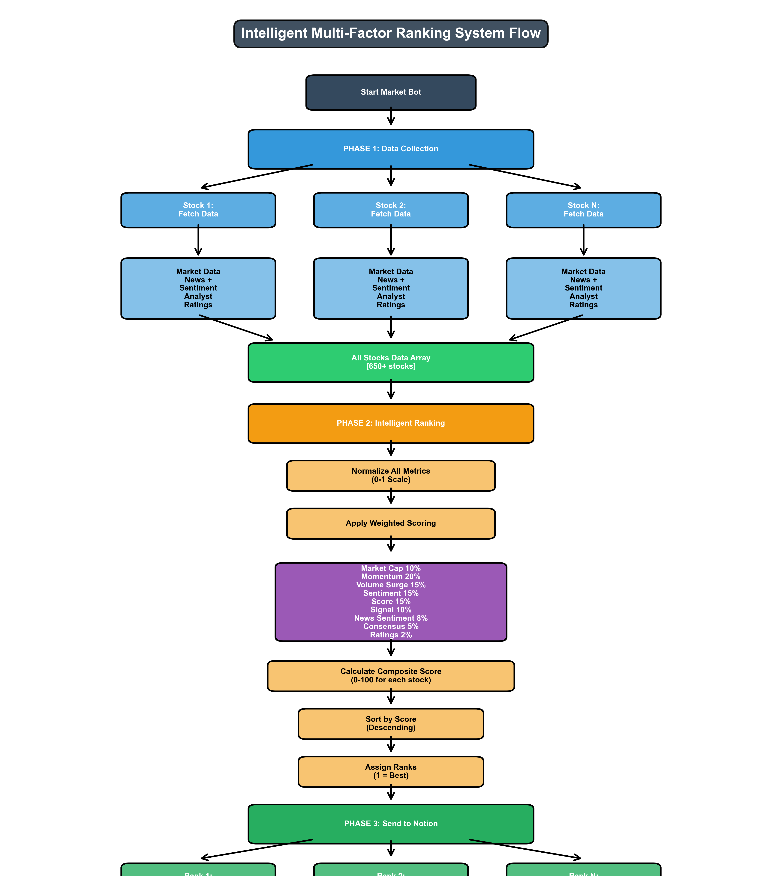
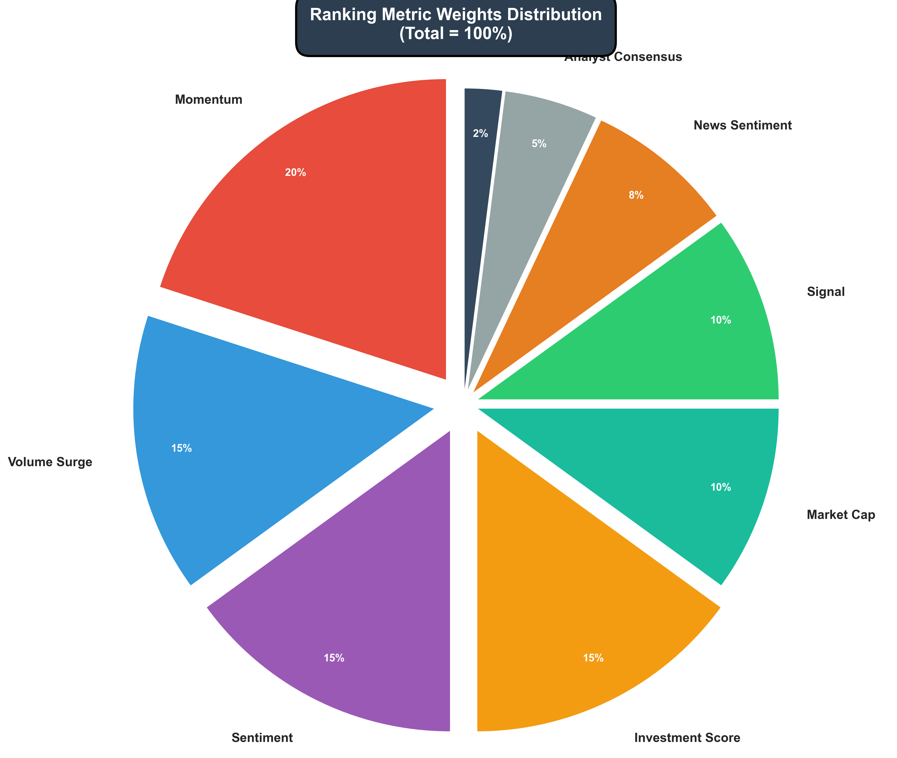

# 🎨 Ranking System Visual Documentation

This document provides visual representations of the Intelligent Multi-Factor Ranking System.

## 📊 Overview

The ranking system has been implemented with two comprehensive visual flowcharts:

1. **Intelligent Multi-Factor Ranking System Flow** - Shows the complete 3-phase process
2. **Ranking Metric Weights Distribution** - Displays the weighted importance of each metric

---

## 🔄 1. Intelligent Multi-Factor Ranking System Flow

This flowchart illustrates the complete end-to-end ranking process in three phases:

### Visual Diagram



### Process Breakdown

#### **PHASE 1: Data Collection** (Blue)
- Fetches market data for all 650+ stocks
- Collects:
  - Market metrics (price, momentum, volume)
  - News articles and sentiment
  - Analyst ratings and consensus
- Calculates signal and investment score
- Stores all data in array for processing

#### **PHASE 2: Intelligent Ranking** (Orange)
- Normalizes all metrics to 0-1 scale
- Applies weighted scoring algorithm:
  - Market Cap: 10%
  - Momentum: 20% (highest)
  - Volume Surge: 15%
  - Sentiment: 15%
  - Investment Score: 15%
  - Signal: 10%
  - News Sentiment: 8%
  - Analyst Consensus: 5%
  - Analyst Ratings: 2%
- Calculates composite score (0-100) for each stock
- Sorts stocks by score in descending order
- Assigns ranks (1 = best)

#### **PHASE 3: Send to Notion** (Green)
- Uploads stocks to Notion database
- Includes rank number with each entry
- Preserves all original metrics
- Stocks sorted by quality

---

## 📈 2. Ranking Metric Weights Distribution

This pie chart shows the relative importance of each metric in the ranking calculation:

### Visual Diagram



### Weight Analysis

The metrics are weighted as follows:

| **Metric** | **Weight** | **Rationale** |
|------------|------------|---------------|
| **Momentum** | 20% | Most critical - identifies growth stocks and price trends |
| **Volume Surge** | 15% | High trading activity signals investor interest |
| **Sentiment** | 15% | AI/keyword analysis of market mood |
| **Investment Score** | 15% | Composite technical indicator |
| **Market Cap** | 10% | Company size and stability factor |
| **Signal** | 10% | Trading signal classification |
| **News Sentiment** | 8% | Recent news impact |
| **Analyst Consensus** | 5% | Professional recommendations |
| **Analyst Ratings** | 2% | Numeric analyst scores |

### Weight Categories

- **Technical Metrics** (35%): Momentum + Volume Surge
- **Sentiment Metrics** (23%): Sentiment + News Sentiment
- **Score & Signal** (25%): Investment Score + Signal
- **Fundamentals** (10%): Market Cap
- **Expert Opinion** (7%): Consensus + Ratings

---

## 🎯 Key Insights

### 1. Momentum Dominates
With 20% weight, **momentum** is the most important factor. This reflects the strategy of identifying stocks with strong recent performance.

### 2. Balanced Approach
The system balances:
- **Technical analysis** (momentum, volume)
- **Sentiment analysis** (AI, news)
- **Fundamental metrics** (market cap)
- **Expert opinion** (analysts)

### 3. Three-Phase Design
The sequential phases ensure:
- Complete data collection before ranking
- Fair comparison across all stocks
- Optimal ranking before upload

### 4. Transparency
Every metric's contribution is visible and adjustable, making the system:
- Easy to understand
- Simple to customize
- Fully auditable

---

## 🔧 Customization

To modify the weights, edit `src/core/ranking_engine.py`:

```python
RANKING_WEIGHTS = {
    'market_cap': 0.10,
    'momentum': 0.20,      # ← Increase for growth focus
    'volume_surge': 0.15,
    'sentiment': 0.15,
    'score': 0.15,
    'signal': 0.10,
    'news_sentiment': 0.08,
    'consensus': 0.05,     # ← Increase for analyst-driven
    'ratings': 0.02
}
```

**Important:** All weights must sum to 1.0 (100%)

---

## 📂 File Locations

- **Flowchart 1**: `docs/Ranking_System_Flow.png`
- **Flowchart 2**: `docs/Ranking_Weights_Distribution.png`
- **Generator Script**: `utilities/create_ranking_flowcharts.py`

To regenerate the visualizations:
```bash
python utilities/create_ranking_flowcharts.py
```

---

## 📚 Related Documentation

- **[RANKING_SYSTEM.md](RANKING_SYSTEM.md)** - Complete technical documentation
- **[QUICK_RANKING_GUIDE.md](QUICK_RANKING_GUIDE.md)** - Quick reference guide
- **[TECHNICAL_DOCUMENTATION.md](TECHNICAL_DOCUMENTATION.md)** - System architecture

---

## ✅ Summary

These visualizations provide:
- ✅ Clear understanding of the ranking process
- ✅ Transparency in metric weighting
- ✅ Easy reference for customization
- ✅ Professional documentation for stakeholders

The ranking system transforms your market bot from a simple data collector into an **intelligent stock analysis engine**! 🚀
